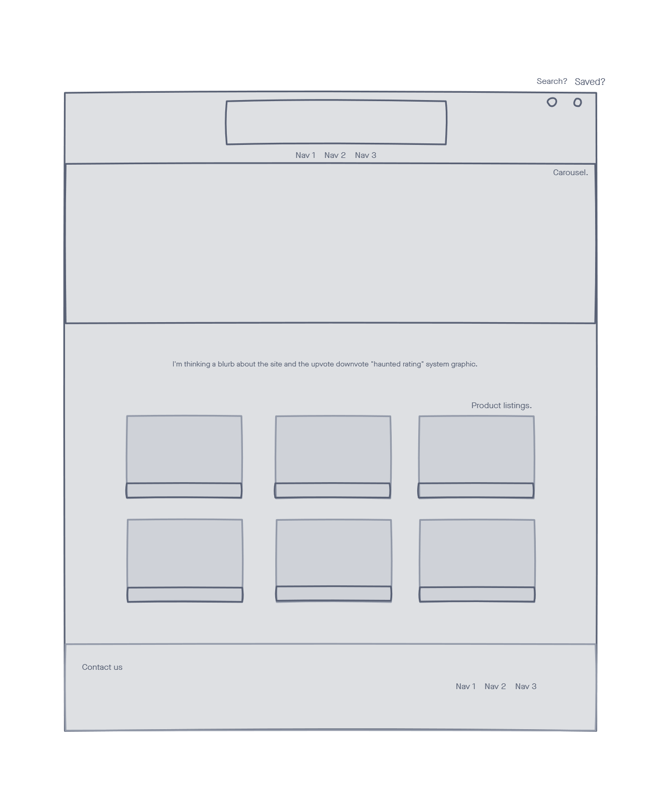

#HAUNTED DOLLHOUSE

## [Website](https://haunted-doll-house.herokuapp.com/)

## Checklist:

* Search for different artifacts
* Login to forum
* Create posts on forum about certain artifact
* View different posts on forum about different artifacts

## Description:

This project is a forum that allows users to post about the most cursed artifacts on the internet as well as allow them to search for specific ones as well. 
In addition, users can create accounts so they can up comment on posts, up vote posts, and down vote posts.

## User Story: 
As a person who is really into cursed artifacts, I want to know where I can find information about as many cursed artifacts as possible. 

## Wireframe:

## Breakdown Of Tasks:

* Andrew: Front-end handlebars, adding images to site, read-me, presentation, seeds
* Austin: API Creation, Routing, DB Models, Relations, Handlebars, Login, Logout, Signup, Post Creation,Deletion,Server,Heroku-Hosting
* Haley: Illustration, Front End Design, and Creation
* Ebad: userRoutes GET and POST requests with the database, model/user.js, functional footer

## Features:

* Page for users to login into forum as well as sign up
* Page allowing users to create their own posts.
* GET and POST requests with database.
* Search page allowing users to search for different artifacts.

